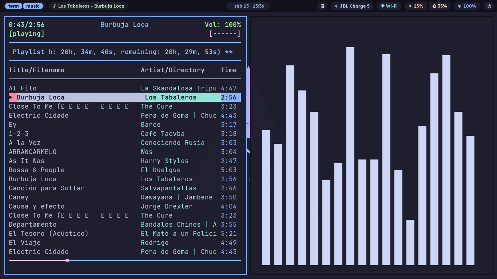

# Conectar Igualdad SF20GM7 - Sway + Waybar

Configuración personal de Arch Linux en una netbook Conectar Igualdad SF20GM7.

## Vista



## Entorno

- Arch Linux
- Sway
- Waybar
- foot
- fuzzel
- mako
- Catppuccin
- Yazi
- systemd-boot

## Estructura

- `home/`: archivos que se restauran sobre `$HOME`.
- `home/.config/`: configuración de aplicaciones de usuario.
- `home/.local/bin/`: scripts locales ejecutables.
- `polkit/`: reglas de polkit para copiar con permisos de sistema.
- `bootloader/`: archivos de systemd-boot para revisar/restaurar manualmente.
- `docs/`: inventario y listas de paquetes.
- `docs/media/`: capturas o material visual para documentación.

## Características principales

- Configuración modular de Sway.
- Waybar con módulos de música, discos, CPU, memoria, Bluetooth, red, audio, brillo, batería y energía.
- Menús flotantes con foot y fuzzel.
- Notificaciones con mako.
- Manejo de dispositivos externos/removibles con disk-manager, disk-status y disk-notify.
- Power menu con bloqueo, suspensión, reinicio, apagado y salida de Sway.
- Reglas polkit para discos y energía local.
- systemd-boot ajustado con console-mode max.
- Scripts locales con validación básica de dependencias y fallos no fatales de notificación.
- Verificador local para restauración, paquetes, scripts, Yazi, XDG, polkit y bootloader.
- Yazi con Catppuccin Mocha, plugins oficiales y previews completas.
- Carpetas XDG del usuario registradas en español.
- OneDrive con cliente `onedrive-abraunegg` y configuración local segura.

## Restauración

- Paquetes pacman actuales: `docs/pkglist-pacman.txt`
- Paquetes AUR actuales: `docs/pkglist-aur.txt`
- Configuración de usuario versionada bajo `home/`.
- Configuración de sistema versionada bajo `polkit/` y `bootloader/`.

Restauración de usuario:

```sh
./restore.sh
```

Restauración completa:

```sh
./restore.sh --all
```

Antes de aplicar cambios se puede revisar qué haría:

```sh
./restore.sh --all --dry-run
```

Verificación del estado restaurado:

```sh
./check.sh
```

Para exigir también polkit y bootloader como obligatorios:

```sh
./check.sh --system
```

Para permitir que la verificación pida contraseña de sudo y compare archivos protegidos:

```sh
./check.sh --system --sudo
```

## OneDrive

La configuración versionada en `home/.config/onedrive/config` solo ajusta opciones seguras del cliente. No se versionan tokens, bases SQLite ni credenciales.

Después de restaurar, vincular la cuenta:

```sh
onedrive
```

Habilitar sincronización automática:

```sh
systemctl --user enable --now onedrive.service
```

Consultar el estado:

```sh
systemctl --user status onedrive.service
journalctl --user -u onedrive.service -f
```

## Notas

Esta configuración está pensada para uso personal en la netbook conectar-igualdad.

No incluye backups, claves privadas, tokens ni archivos sensibles.

Los backups manuales de auditoría se guardan fuera del historial Git y están ignorados mediante `backups/`.
